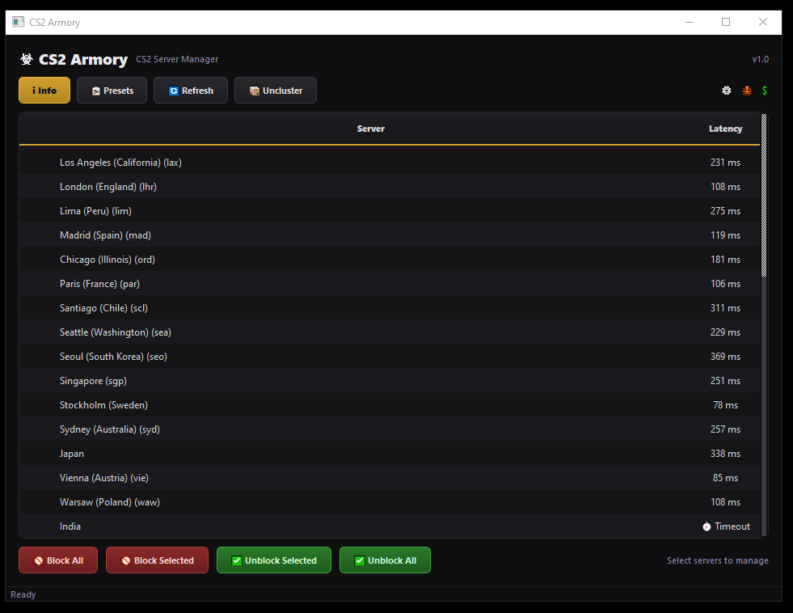

<p align="center">
  
</p>

<h1 align="center">CS2 Armory</h1>

<p align="center">
  <b>Take control of Counter-Strike 2 matchmaking by choosing exactly which Steam relay servers your client can use</b>
</p>

<p align="center">
  
  
  
  
</p>

<p align="center">
  <a href="#english">English</a> •
  <a href="#فارسی">فارسی</a> •
  <a href="#русский">Русский</a>
</p>

---

<a id="english"></a>
## English

Valve's matchmaking automatically picks your relay servers based on a ping estimate that doesn't always match reality. CS2 Armory puts that choice back in your hands. It pulls the live list of Steam Datagram Relay (SDR) servers directly from Steam and lets you block the ones you don't want using native Windows Firewall rules.

No config hacks, no third-party proxies just clean outbound rules that Steam matchmaking is forced to respect.

### Key Features

* **Live Server Sync**: Fetches current SDR configurations straight from Steam's API, keeping the list up-to-date after Valve updates.
* **Smart Clustering**: Groups nearby relay servers (e.g., all China or India PoPs) to prevent clutter and make selection easy.
* **One-Click Controls**: Block everything except your target region, or target a specific list of servers in seconds.
* **Custom Presets**: Save your favorite configurations (like "EU Only" or "No Asia") and apply them instantly.
* **Built-in Ping Tool**: Run latency checks directly within the app before making your routing choices.
* **Firewall Diagnostics**: Quickly check your Windows Firewall status and restore defaults if needed.

### How It Works

CS2 Armory manages outbound block rules in Windows Firewall that target the IP ranges of the selected relay servers. Since Steam matchmaking cannot reach blocked relays, it automatically falls back to your allowed, active locations. 

The app operates in its own dedicated firewall namespace, meaning it won't interfere with other software or system configurations, and cleanly deletes its rules upon unblocking.

> ⚠️ **Note**: Because the application modifies Windows Firewall rules, it **must be run as Administrator**.

### Installation & Run

#### Prebuilt Executable
1. Download the latest version from the **[Releases](../../releases)** page.
2. Run the `.exe` file and accept the UAC administrator prompt.

### ScreenShot



#### Running from Source
```bash
git clone https://github.com/Arianlavi/cs2armory.git
cd cs2armory
pip install -r requirements.txt
python main.py

```

### Quick Start

1. Open the app as Administrator and wait for the server list to populate.
2. Select the servers you wish to restrict, or choose a saved preset.
3. Click **Block** (to disable specific servers) or **Block Except Preset** (to whitelist only your preferred region).
4. Click **Unblock** at any time to restore default matchmaking.

---

## فارسی

سیستم متچ میکینگ بازی کانتر استرایک ۲ معمولا سرورهای اتصال شما را بر اساس تخمین پینگی انتخاب میکند که همیشه دقیق نیست. برنامه CS2 Armory کنترل این موضوع را به شما برمیگرداند. این برنامه لیست زنده سرورهای Steam Datagram Relay را مستقیم از استیم میگیرد و به شما اجازه میدهد سرورهای نامناسب را از طریق فایروال ویندوز مسدود کنید.

بدون نیاز به تغییر فایل های بازی یا استفاده از پروکسی های ناشناس، فقط با استفاده از قوانین فایروال سیستم که استیم مجبور به رعایت ان ها است.

### امکانات اصلی

* **دریافت لیست زنده سرورها**: دریافت مستقیم اطلاعات از سرورهای استیم تا لیست شما با اپدیت های بازی قدیمی نشود.
* **دسته بندی منطقه ای**: سرورهای نزدیک به هم (مثل تمام سرورهای هند یا چین) دسته بندی میشوند تا نیازی به جستجو در لیست های شلوغ نداشته باشید.
* **مسدودسازی با یک کلیک**: مسدود کردن همه سرورها به جز منطقه مورد نظر شما یا مسدود کردن چند سرور خاص به راحتی.
* **ذخیره لیست های دلخواه**: تنظیمات خود را (مثلا فقط اروپا) ذخیره کنید و در دفعات بعدی با یک کلیک اجرا کنید.
* **تست پینگ داخلی**: قبل از مسدود کردن سرورها، میزان تاخیر و پینگ خود را به ان ها مشاهده کنید.
* **ابزار مدیریت فایروال**: بررسی وضعیت فایروال ویندوز و امکان بازگرداندن تنظیمات فایروال به حالت اولیه.

### روش کار برنامه

این برنامه قوانین مسدودسازی برای ترافیک خروجی در فایروال ویندوز ایجاد میکند که رنج ای پی سرورهای انتخابی شما را هدف قرار میدهند. وقتی سیستم متچ میکینگ استیم نتواند به این سرورها متصل شود، به سراغ سرورهای باز و مجاز دیگر میرود.

تمام قوانین ایجاد شده در بخش اختصاصی خود برنامه ثبت میشوند تا هیچ تغییری در بقیه بخش های سیستم شما ایجاد نشود و در صورت نیاز به راحتی و بدون مشکل پاک شوند.

> ⚠️ **نکته**: برای اعمال تغییرات در فایروال ویندوز، این برنامه حتما باید با دسترسی **Administrator** اجرا شود.

### روش نصب و اجرا

#### استفاده از نسخه اماده

۱. اخرین نسخه برنامه را از صفحه **[Releases](https://www.google.com/search?q=../../releases)** دانلود کنید.
۲. فایل اجرایی را باز کنید و دسترسی ادمین را تایید کنید.

#### اجرا از طریق سورس کد

```bash
git clone https://github.com/Arianlavi/cs2armory.git
cd cs2armory
pip install -r requirements.txt
python main.py

```

#### نحوه استفاده

۱. برنامه را با دسترسی ادمین باز کنید تا لیست سرورها دریافت شود.
۲. سرورهای مورد نظر خود را انتخاب کنید یا از لیست های ذخیره شده استفاده کنید.
۳. روی دکمه **Block** یا **Block Except Preset** کلیک کنید تا محدودیت ها اعمال شوند.
۴. برای برگشتن به حالت عادی متچ میکینگ بازی، در هر زمان میتوانید دکمه **Unblock** را بزنید.

---

## Русский

Матчмейкинг Counter-Strike 2 автоматически выбирает для вас релейные серверы на основе оценки пинга, которая не всегда соответствует реальности. CS2 Armory возвращает этот контроль вам. Приложение загружает актуальный список серверов Steam Datagram Relay (SDR) напрямую от Steam и позволяет блокировать ненужные локации на уровне брандмауэра Windows.

Никаких изменений файлов игры или сторонних прокси — только чистые правила исходящего трафика, которые клиент Steam обязан соблюдать.

### Основные возможности

* **Синхронизация серверов**: Загрузка актуального списка SDR напрямую из Steam API, что гарантирует работоспособность после обновлений Valve.
* **Умная группировка**: Объединение близких релейных точек (например, все узлы в Китае или Индии) для удобной навигации.
* **Блокировка в один клик**: Возможность заблокировать всё, кроме выбранного региона, или ограничить доступ к конкретным серверам.
* **Пользовательские пресеты**: Сохраняйте готовые наборы настроек (например, «Только Европа» или «Без Азии») для мгновенного применения при запуске.
* **Проверка задержки**: Встроенный пинг-тест позволяет оценить качество соединения с каждым сервером перед его блокировкой.
* **Диагностика брандмауэра**: Быстрая проверка статуса брандмауэра Windows и возможность сбросить правила до исходного состояния.

### Принцип работы

CS2 Armory создает правила для исходящих подключений в брандмауэре Windows, блокируя диапазоны IP-адресов нежелательных релеев. Поскольку клиент Steam не может связаться с заблокированными точками, он автоматически перенаправляет поиск матча на доступные вам серверы.

Все правила создаются в отдельном пространстве имен приложения. Это гарантирует безопасность для остальной системы и позволяет полностью и чисто удалить все ограничения одной кнопкой.

> ⚠️ **Важно**: Поскольку программа работает с сетевыми правилами Windows, для ее запуска **требуются права администратора**.

### Установка и запуск

#### Готовая сборка (Рекомендуется)

1. Скачайте последнюю версию программы со страницы **[Releases](https://www.google.com/search?q=../../releases)**.
2. Запустите `.exe` файл и подтвердите запрос прав администратора (UAC).

#### Запуск из исходного кода

```bash
git clone https://github.com/Arianlavi/cs2armory.git
cd cs2armory
pip install -r requirements.txt
python main.py

```

### Использование

1. Запустите приложение от имени администратора и дождитесь загрузки списка серверов.
2. Выберите серверы для блокировки или примените сохраненный пресет.
3. Нажмите **Block** или **Block Except Preset** (чтобы оставить доступным только один выбранный регион).
4. Нажмите **Unblock** в любой момент, чтобы вернуть стандартный поиск игр.

---

### Support

If CS2 Armory made your matchmaking experience better, consider supporting development:

* **[Donate via Crypto](https://plisio.net/donate/uTXSR0Q1)**

### Disclaimer

This tool only manages local Windows Firewall rules on your own machine. It does not modify game files, inject into the CS2 process, or interact with server-side components. It does not guarantee lower ping; it only influences which matchmaking relays your client is allowed to connect to. Use responsibly and at your own discretion.
